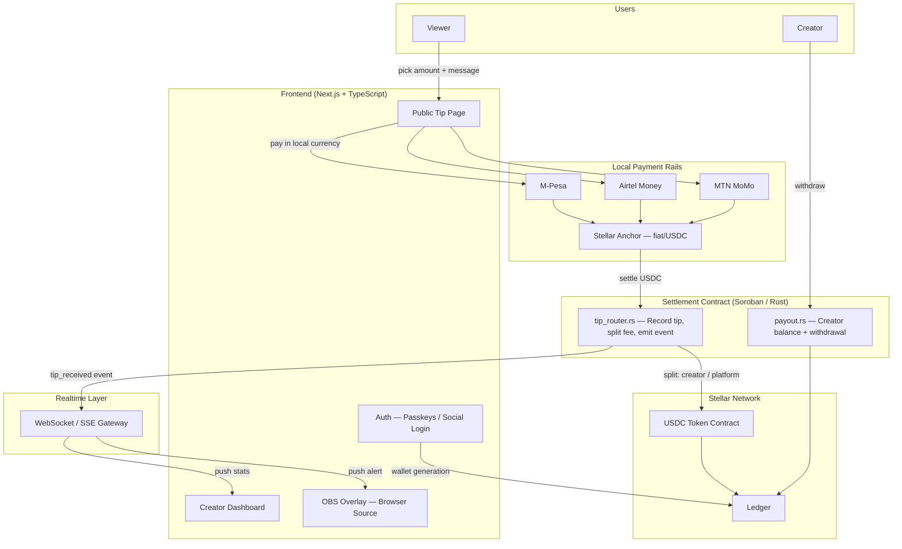
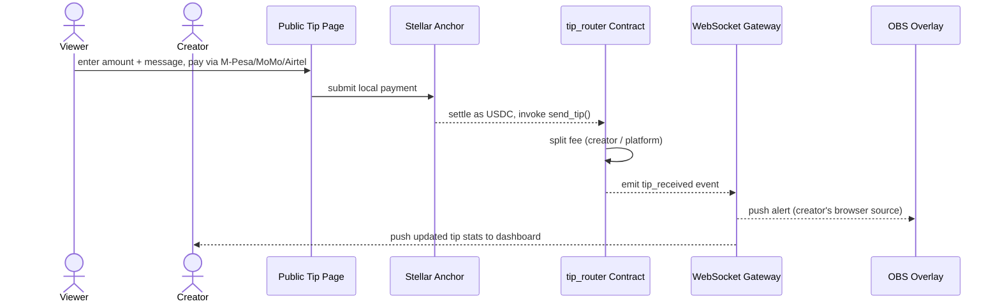

# CreatorPesa

[](https://github.com/CreatorPesa/Frontend/actions/workflows/ci.yml)

Next.js and TypeScript client for the CreatorPesa network — a creator dashboard with video analytics, public tipping surfaces built for local African payment rails, and live OBS browser-source overlay alerts driven by instant on-chain settlement.

## Overview

CreatorPesa lets African creators get tipped the way YouTubers and Twitch streamers do in the US, without asking viewers to own crypto or hold a foreign bank card. A viewer pays with M-Pesa, Airtel Money, or MTN MoMo; the payment is converted to USDC and settled on Stellar in seconds; the creator's OBS overlay fires an on-stream alert the moment the tip lands, and the dashboard's analytics update in real time.

Stellar is the settlement backbone: sub-cent fees mean a $0.50 tip is still worth sending, built-in anchors handle the fiat conversion so viewers never touch a wallet directly, and a lightweight Soroban contract records each tip, splits the platform fee, and emits the event that drives the overlay and the dashboard.

This repository is the frontend client — the dashboard, the public tip pages, and the OBS overlay surface. It talks to the Stellar network and to CreatorPesa's payment/anchor integrations, but does not itself hold custody of funds.

**Status**: the frontend itself — dashboard, public tip page, OBS overlay, wallet connect, sponsorship proposals, membership tier management — is built out and tested. It calls a `backend` API and `contracts` that don't exist yet, so nothing works end-to-end until those sibling repos land. See [Roadmap](#roadmap) for the split.

## Features

- **Creator Dashboard**: Video analytics (views, watch time, top clips) alongside tipping analytics (top supporters, tip volume, payout history)
- **Public Tipping Page**: A shareable per-creator page where viewers tip via local mobile money, no crypto knowledge required
- **Live OBS Overlay**: A browser-source URL, unique per creator, that renders on-stream alerts the instant a tip settles
- **Instant On-Chain Settlement**: Tips settle on Stellar in seconds rather than the days typical of local payment rails
- **Local Payment Rails**: M-Pesa, Airtel Money, and MTN MoMo on-ramps via Stellar anchors — viewers pay in local currency
- **Passkey / Social Auth**: Creators and viewers log in with email or social auth; a Stellar wallet is generated silently behind the scenes
- **Token-Gated Overlay URLs**: Each OBS browser source is signed per creator so alert streams can't be spoofed or scraped

## Architecture



### Core Components

- **tip_router.rs**: Records each tip on-chain, splits the platform fee from the creator's share, and emits a `tip_received` event
- **payout.rs**: Tracks each creator's accumulated balance and handles withdrawal to their linked payout method
- **WebSocket/SSE gateway**: Subscribes to on-chain events and fans them out to the connected OBS overlay and dashboard sessions for a given creator
- **Anchor integration**: Converts local mobile-money payments to USDC and back, so viewers and creators never have to manage a wallet manually

## Tech Stack

| Component      | Technology                                   | Purpose                                                             |
| -------------- | -------------------------------------------- | ------------------------------------------------------------------- |
| Frontend       | Next.js + TypeScript + TailwindCSS           | Creator dashboard, public tip page, OBS overlay                     |
| Realtime       | WebSockets / Server-Sent Events              | Push tip alerts to the OBS browser source and dashboard instantly   |
| Settlement     | Rust + Soroban (Stellar)                     | Tip recording, platform fee split, creator payout accounting        |
| Local Payments | M-Pesa / Airtel Money / MTN MoMo via anchors | Fiat on-ramp so viewers can tip without holding crypto              |
| Wallet / Auth  | Freighter Wallet / Stellar Passkeys          | Blockchain auth; silent custodial wallet generation on social login |

## Tip Flow — Sequence Diagram



## Tip Lifecycle — State Machine

```
┌───────────┐
│ Initiated │  ← viewer submits payment on the tip page
└─────┬─────┘
      │
      ▼
┌───────────┐
│ Converted │  ← anchor settles local currency to USDC
└─────┬─────┘
      │
      ▼
┌───────────┐
│  Settled  │  ← tip_router records tip on-chain, fee split executed
└─────┬─────┘
      │
      ▼
┌───────────┐
│  Alerted  │  ← WebSocket gateway pushes alert to OBS overlay
└─────┬─────┘
      │
      ▼
┌───────────┐
│Reconciled │  ← dashboard analytics updated with the new tip
└───────────┘
```

## Security Features

1. **Signed Overlay URLs**: Each OBS browser source URL is signed per creator so alert streams can't be spoofed or replayed by third parties
2. **Atomic Fee Splits**: Fee split and balance credit happen in a single on-chain transaction — no partial payouts
3. **Authorization Checks**: All withdrawal and payout-configuration operations require proper Stellar account authorization
4. **Replay Protection**: Tip events carry a nonce so a duplicate anchor callback can't double-credit a creator
5. **Rate Limiting**: Public tip endpoint is rate-limited per viewer session to reduce spam and abuse

## Quick Start

### 1. Install Dependencies

```bash
npm install
```

This also runs `husky` via the `prepare` script, wiring up the pre-commit hook (lint-staged + typecheck) described in [CONTRIBUTING.md](CONTRIBUTING.md).

### 2. Configure Environment

```bash
cp .env.example .env.local
# fill in NEXT_PUBLIC_API_URL, NEXT_PUBLIC_WS_URL, and the Stellar/contract values
```

### 3. Run the Frontend

```bash
npm run dev
```

Data-fetching pages (dashboard, public tip page) expect a running `backend` — without one, they'll show the error boundary rather than data.

## Configuration

CreatorPesa uses environment variables for configuration across environments (local, testnet, mainnet).

| Variable                           | Description                                               |
| ---------------------------------- | --------------------------------------------------------- |
| `NEXT_PUBLIC_API_URL`              | Backend API base URL                                      |
| `NEXT_PUBLIC_WS_URL`               | WebSocket URL for the realtime tip feed                   |
| `NEXT_PUBLIC_NETWORK`              | `testnet` or `mainnet`                                    |
| `NEXT_PUBLIC_HORIZON_URL`          | Stellar Horizon endpoint                                  |
| `NEXT_PUBLIC_SOROBAN_RPC`          | Soroban RPC endpoint                                      |
| `NEXT_PUBLIC_ESCROW_CONTRACT_ID`   | Deployed Escrow contract address (from `contracts`)       |
| `NEXT_PUBLIC_SPLITTER_CONTRACT_ID` | Deployed Payment Splitter contract address                |
| `NEXT_PUBLIC_REGISTRY_CONTRACT_ID` | Deployed Creator Registry contract address                |
| `NEXT_PUBLIC_SESSION_COOKIE_NAME`  | Name of the session cookie the backend issues after OAuth |

Validated at import time via a `zod` schema (`src/lib/env.ts`) — a missing variable fails fast at build/server-start instead of surfacing as an obscure runtime error later.

## Testing

```bash
npm run lint
npm run typecheck
npm run test
npm run build
```

39 tests cover form validation (via the `zod` schemas in `src/lib/validation/`), success/failure paths for every API-backed form, and the realtime tip-feed merge/dedup logic. See [CONTRIBUTING.md](CONTRIBUTING.md) for the full pre-PR checklist and testing conventions.

## MVP Scope

The initial testnet MVP focuses on a single end-to-end flow:

1. A viewer tips a creator via M-Pesa on the public tip page
2. The payment settles as USDC, the fee splits instantly between creator and platform
3. The creator's OBS overlay fires an alert and the dashboard reflects the new tip

Everything else (Airtel/MoMo on-ramps, full video analytics, passkey login) ships in subsequent milestones.

## Roadmap

### This repo (frontend)

- [x] Public tip page with payment-method picker (M-Pesa / Airtel Money / MTN MoMo / bank / crypto)
- [x] Creator dashboard — earnings summary, live tip feed, payouts, revenue splits
- [x] OBS browser-source overlay with realtime tip alerts
- [x] Wallet connect (Freighter) flow
- [x] Sponsorship deal proposal flow
- [x] Membership tier management
- [ ] Real video analytics (currently a placeholder series pending the analytics endpoint)

### Cross-repo (blocked on `backend` / `contracts`)

- [ ] `backend` service implementing the REST/WebSocket API this frontend already calls
- [ ] `tip_router` / Payment Splitter / Creator Registry Soroban contracts
- [ ] Real anchor integrations (M-Pesa, Airtel Money, MTN MoMo)
- [ ] Passkey / social login issuing the session this frontend reads
- [ ] Mainnet launch

## Dependencies

Core dependencies (see `package.json` for exact versions):

- `next`, `react` — application framework
- `typescript`, `tailwindcss` — type safety and styling
- `zod` — env validation and form-schema validation
- `@stellar/stellar-sdk`, `@stellar/freighter-api` — Stellar network and wallet integration
- `recharts` — dashboard analytics chart
- `qrcode.react` — QR code on the public tip page

Dev tooling: `vitest` + `@testing-library/react` for tests, `eslint` + `prettier` for lint/format, `husky` + `lint-staged` for pre-commit checks, `@next/bundle-analyzer` (run via `npm run analyze`).

## License

MIT

## Support

- GitHub Issues: [Create an issue](https://github.com/CreatorPesa/Frontend/issues)
- Stellar Developers: https://developers.stellar.org

## Contributing

Contributions are welcome! See [CONTRIBUTING.md](CONTRIBUTING.md) for setup, the pre-PR checklist, and code conventions (validation schemas, server/client component boundaries, error handling).
